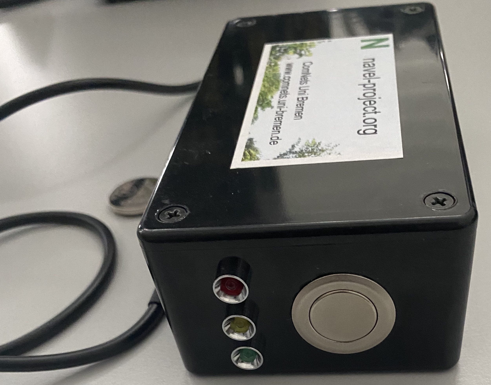
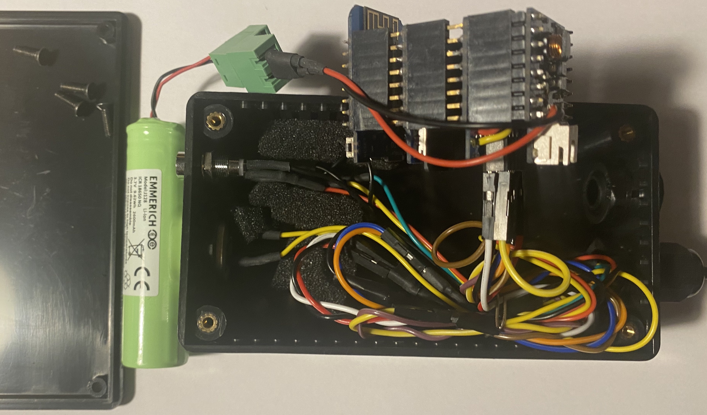

# Food Safety Prototype

The Food Safety Prototype demonstrates how the resources available at the FAB Lab can be used to develop a solution for a specific use case. The use case relates to transporting meat or milk safely in Cameroon. This README provides the details of the scenario, the hardware used and the code of the prototype. The following locations have further details.

- [Design](./design/) - Contains the flow charts of the prograsm logic, pin assignments, etc.
- [Program code](./code/) - Contains the program code of the prototype


## Scenario

There are a number of different transportation means used by producers of meat and milk to deliver them to the sellers who will further process or sell directly to customers. During the transportation, the products are refrigerated but due to technical reasons, the refrigeration may fail. But, to know whether such a failure occured, there is not control mechanisms adopted.

The idea of this prototype is to build a self contained temperature monitoring device that is able to inform the sellers about the changes of the temperature during transport. The prototype will consit of a visual indicator to indicate whether temperature had exceeded a certain threshold during the transportation. Addition to this indications, the prototype also logs the temperature with time. For further analysis, the sellers can download this information to analyse the behaviour.

The picture below shows the protoype. It consist of the following components.

- Temperature sensor
- Button
- 3 LEDs (Red, Green and Blue)

<p align="center">
    
</p>
<p align="center">
    <em>The protype from the top with its temperature sensor against the backdrop of a CR2032 coin battery</em>
</p>

<p align="center">
    
</p>
<p align="center">
    <em>The protype from the side where the button and the 3 LEDs are visible</em>
</p>

The operation of the prototype is described in the following text.

- When the prototype boots up, the red and green LEDs will blink sequentially 3 times to indicate that it is ready for operation.
- When the button is pressed for a short time, between 3 and 7 seconds, the prototype will start logging the temperature. 
- The temperature will be logged every 10 seconds together with a green blink of the LED.
- When logging the temperature, if the average temperature from the last 8 readings exceeds a threshold (set to 7 degrees celcius), then the red LED will be lit permenently until a reset is done.
- If a long button press is performed, a press above 8 seconds, the a WLAN access point and a web server is brout up by the protype.
- The user can connect to this WLAN AP and use a web browser to browse and download data.
- A the same short press above, if done while the temperature is being logged, results in clearing the threshold exceed indicator (red LED) and starting a new round of temperature logging.

## Hardware

The prototype is based on the `Wemos D1 ESP8266` board placed together with other shields. The list of shields used are as follows.

- Wemos D1 ESP8266 shield
- SD card shield
- Battery shield
- Port explansion shield

The components attached to these sheilds are as follows.

- 3 LEDs (red green and blue)
- DS18S20 temperature sensor connected over 1-wire interface
- Push button
- 3.7V 2600mAh rechargeable battery
- Cables connecting the pins and the components

The picture below shows the prototype opened up.

<p align="center">
    
</p>
<p align="center">
    <em>The prototype open showing all components and connections</em>
</p>

The following table lists the pin assignments of the prototype.

| Pin on Board   | Pin on ESP8266  | Details                                            |
|----------------|-----------------|----------------------------------------------------|
| TX             | TXD             | TXD (don't use)                                    |
| RX             | RXD             | RXD (don't use)                                    |
| A0             | A0              | Analog input, max 3.2V, not used                   |
| D0             | GPIO16          | Connected to RST                                   |
| D1             | GPIO5           | Green LED                                          |
| D2             | GPIO4           | Red LED                                            |
| D3             | GPIO0           | Button -> GND (Pullup)                             |
| D4             | GPIO2           | IO, 10k Pull-up built-in LED, OneWire sensor Data  |
| D5             | GPIO14          | CLK SDcard                                         |
| D6             | GPIO12          | MISO SDcard                                        |
| D7             | GPIO13          | MOSI SDcard                                        |
| D8             | GPIO15          | SS SDcard                                          |
| G              | GND             | Ground                                             |
| 5V             | 5V              | not available                                      |
| 3V3            | 3.3V            | 3.3V connection                                    |
| RST            | RST             | Reset                                              |


## Code

The code of the program consist of a number of parts (listed below) that are invoked to perform different activities. 

- Reading temperature sensor
- Averaging temperature values to check whether threshold exceeded
- Handling button presses (long press or short press) through an interrupt handler
- Setting up temperature logging
- Starting or stopping the WLAN access point and the web server
- Writing to SD card
- Setting up web server with the logged data
- Sleeping to save energy
- Serving web pages
- Forcing memory usage cleanup (garbage collection)


The following sections show and describe the code related to the above activities.

#### Reading temperature sensor

The sensor is connected over a [1-Wire](https://en.wikipedia.org/wiki/1-Wire) interface. This interface may be used by multiple sensors and therefore, it has to be initialized and a handle must be obtained for the temperature sensor to work with.

```Python
# Enable one wire temerature sensor
ow = onewire.OneWire(machine.Pin(2))
ow.scan()                # return a list of devices on the bus
ow.reset()               # reset the bus
ds = ds18x20.DS18X20(ow) # get handle
```

With the obtained handle, the function below retrives the value (i.e., the temperature) reported by the sensor.

```Python
# read temperature value from sensor
def read_sensors():
    temp = 0
    roms = ds.scan()
    ds.convert_temp()
    time.sleep_ms(750)
    res = {}
    for rom in roms:
        temp = ds.read_temp(rom)
        res[ubinascii.hexlify(rom)] = temp
    res["time"] = str(time.time())
    return res, temp
```
This part of the program code shows the actual call to the function to get the temperature and store it in a dictionary, so that it can be written to the log in the JSON format. 

```Python
# read temperature from sensor
data = {}
data["id"] = esp.flash_id()
data["data"], temp = read_sensors()
```

#### Averaging temperature and checking threshold

An array is maintained to collect the last 8 readings. These values are averaged  to check whether a threshold temperature value is exceeded. If exceeded, then the red LED must be lit until the next reset.

```Python

# add to list
average_list.append(temp)

# perform threshold check
if len(average_list) >= TEMP_AVG_FREQ:

    # compute average
    average = sum(average_list)/len(average_list)

    # init list
    average_list = []

    # check threshold to light red LED and log
    if average >= TEMP_EXCEED_LIMIT:
        led_red.value(1)
        data['msg'] = ('Threshold of ' + str(TEMP_EXCEED_LIMIT) + ' degrees was crossed')
```

#### Handling button presses

Button presses are handled using an interrupt handler. First the interrupt handler must be set.

```Python
# setup button handler (call function)
button.irq(handler=interrupt_handler, trigger=machine.Pin.IRQ_FALLING)
```

Once the interrupt handler is invoked, the button press duration must be calculated. A delay and a counter is used to figure out how long the button was pressed.

```Python
def interrupt_handler(x):
    global session, new_fileid

    # count button press duration
    x = 0
    while button.value() == 0:
        time.sleep(1)
        x += 1
```

#### Setup for temperature logging

If the press is short (between 3 and 7 seconds), then the green LED is blinked and temperature logging is initialized by creating a new log file.

```Python
# check if short press, then log temperature
if x >= 3 and x <= 7:

    # start temperature logging
    logstarted = True

    # init LEDs
    led_green.value(0)
    led_red.value(0)

    # blink green
    for i in range(6):
        led_green.value(not led_green.value())
        time.sleep(SLOW_BLINK_DURATION_SEC)

    # create new log file and log first temperature
    last_fileid += 1
    filename = '/sd/' + DATA_FILENAME + str(last_fileid)
    data = {}
    data['id'] = esp.flash_id()
    data['data'], temp = read_sensors()
    store_data(filename, data)
```

#### Setting up or brining down web server

If the press is long (beyond 8), then the red LED is blinked and actions related to brining up or taking down the WLAN access point and the we server are taken. This is indicated by the state variable `webstarted`.

The long press checking code is as follows.

```Python
# check if long press, then start web server
if x >= 8:

    # blink red
    for i in range(6):
        led_red.value(not led_red.value())
        time.sleep(SLOW_BLINK_DURATION_SEC)
    led_red.value(0)

    ...
```

Once the long presee is detected, then using the `webstarted` actions for starting or stopping web server is done. If the access point and web server are not up, the code below shows how it is brought up. 

```Python
 # start or stop WLAN AP and web server
 if not webstarted:

     # say web server and AP is active now
     webstarted = True

     # bring up WLAN AP
     ap = network.WLAN(network.AP_IF)
     ap.active(True)
     ap.config(password='navel2021')
     while ap.active() == False:
         pass

     # set up web server om port 80
     ssocket = socket.socket(socket.AF_INET, socket.SOCK_STREAM)
     saddr = socket.getaddrinfo('0.0.0.0', 80)[0][-1]
     ssocket.setsockopt(socket.SOL_SOCKET, socket.SO_REUSEADDR, 1) 
     ssocket.bind(saddr)
     ssocket.listen(5)
     ssocket.setblocking(False)

     # setup polling based connections
     poll = select.poll()
     poll.register(ssocket, select.POLLIN)
     time.sleep(2)
```
There are 3 distinct actions to bringing up the web server.

- start WLAN access point with default SSID and a password
- setup server socket to listen and bind to the port 80
- setup polling to detect incomming connections

If the web server is up when the long button press is done, then action is taken to bring down the access point and web server.

```Python
...

else:
    # say web server and AP is not active any more
    webstarted = False
    if DEBUG:
        print('stopping web server')

    # unregister polling
    poll.unregister(ssocket)

    # close socket
    ssocket.close()

    # shutdown WLAN AP
    ap = network.WLAN(network.AP_IF)
    ap.active(False)
```

In this code, the previously described distinct actions are undone in reverse order.


#### Writing to SD card

To use the DS card, a handle must be obtained and then it must be mounted as a file system.

```Python
# get handle to SD card for writing and mount as volume
sd = lib.sdcard.SDCard(machine.SPI(1), machine.Pin(15))
os.mount(sd, '/sd')

# log temperature value
def store_data(filename, data):
    with open(filename, "a") as outfile:
        outfile.write(json.dumps(data) + "\n")
        return outfile.tell() < DATA_MAX_FILE_SIZE
    return True

# initialize temperature logging file
def create_empty_file(filename):
    open(filename, 'a').close()
```

A function is used to write the temperature data to the log. This function additionally reports whether the file size determined by the user has exceeded or not. If the file size is exceeded, a new log file is created and the next temperature readinging will be written to the new file.

The functionality related to readig, writing, formating of an SD card is available in the `lib/sdcard.py` source file.

#### Sleeping to save energy

The usage scenario requires the prototype to run on a battery. Since it is required to be operated for long times (i.e., months), it must attempt at all times to save energy. A way to save energy is to send the prototype to sleep when suitable. A suitable time is between logging temperature. But, if the WLAN access point and web server is up, then sleep should not be activated as it must be ready to serve web pages.

```Python
# set for light sleep - only if logging started but no web server active
if logstarted and not webstarted:
    do_lightsleep = True
else:
    do_lightsleep = False

# check and do light sleep
if do_lightsleep:
    machine.lightsleep(SLEEP_INTERVAL_SEC * 1000)
```
In this prototype, the `machine.lightsleep()` function is used instead of a deep sleep to avoid resetting some of the hardware.

#### Serving web pages

Once the WLAN access point and web server are activated, the prototype must be ready to server web pages. The first activity is to see if there are pending connections.

```Python
# wait for incoming connections
status = poll.poll(SLEEP_INTERVAL_SEC * 1000)
```

This function will return for 2 reasons: either due to a new connection request or because of a timeout. If it is a new connection is requested, then a socket is created and the web request mest be processed.

```Python
# server pages when there are connections
if status:
    # setup connection to requester
    csocket, caddr = ssocket.accept()
    csocket.setblocking(True)

    # read user web request
    csocketfile = csocket.makefile('rwb', 0)
    
    # split request data to identify type
    selectfile = None
    while True:
        line = csocketfile.readline()
        utf8str = line.decode('utf-8')
        if utf8str.startswith('GET') and 'filename=' in utf8str:
            selectfile = utf8str.split(' ')[1].split('=')[1]
        if not line or line == b'\r\n':
            break

```
The requests may be for the following.

- First page (i.e., index page)
- Selected JSON file

The following program code shows the operation of serving pages for both requests.

```Python
# check request details decide what page to show
if not selectfile:
    # show index page with files
    # get first part of index page
    pagepart = ''
    with open('lib/index-part-1.html', 'r') as fp:
        pagepart = fp.read()
    csocket.send(pagepart)

    # get files part of index page
    for name in os.listdir('/sd'):
        pagepart = ('<option value=\"' + name + '\">' + name + '</option>\n')
        csocket.send(pagepart)

    # get last part of index page
    with open('lib/index-part-2.html', 'r') as fp:
        pagepart = fp.read()
        csocket.send(pagepart)
    
    # wait a little
    time.sleep(2)
else:
    # show contents of selected file
    csocket.sendall('HTTP/1.0 200 OK\r\nContent-type: application/json\r\n\r\n')
    csocket.sendall('[')

    # read file contents line by line to send
    with open('/sd/' + selectfile, 'r') as fp:
        isfirst = True
        for line in fp:
            if not isfirst:
                csocket.send(',')
            else:
                isfirst = False
            csocket.sendall(line)
    csocket.sendall(']')
```
Once the web page requested is served, the socket connection must be closed.

```Python
# end session
csocket.close()
```

#### Forcing memory usage cleanup

The ESP8266 is limited in its resource availability and therefore, releasing unused resources such as memory is critical to its proper function. This is done by actively calling gabage collection.

```Python
# release unwanted mem use
gc.collect()
```
