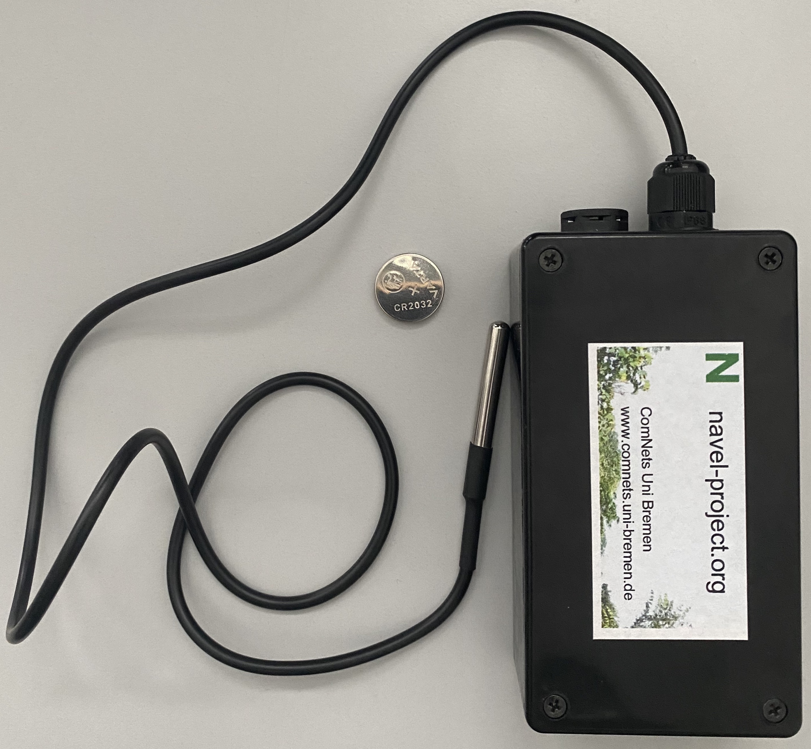

# Food Safety Prototype

The Food Safety Prototype demonstrates how the resources available at the FAB Lab can be used to develop a solution for a specific use case. The use case relates to transporting meat or milk safely in Cameroon. This section provides details of the scenario, the hardware used and the code of the protype.

## Scenario

There are a number of different transportation means used by producers of meat and milk to deliver them to the sellers who will further process or sell directly to customers. During the transportation, the products are refrigerated but due to technical reasons, the refrigeration may fail. But, to know whether such a failure occured, there is not control mechanisms adopted.

The idea of this prototype is to build a self contained temperature monitoring device that is able to inform the sellers about the changes of the temperature during transport. The prototype will consit of a visual indicator to indicate whether temperature had exceeded a certain threshold during the transportation. Addition to this indications, the prototype also logs the temperature with time. For further analysis, the sellers can download this information to analyse the behaviour.

The picture below shows the protoype. It consist of the following components.

- Temperature sensor
- Button
- 3 LEDs (Red, Green and Blue)

    
    <em>The protype from the top with its temperature sensor against the backdrop of a CR2032 coin battery</em>

    
    <em>The protype from the side where the button and the 3 LEDs are visible</em>

The operation of the prototype is described by the following setences.

- When the prototype boots up, the red LED will blink 3 times to indicate that it is ready for operation.
- When the button is pressed for a short time, between 5 and 7 seconds, the prototype will start logging the temperature. This is also considered as a reset of the system.
- The temperature will be logged every 10 seconds and with a green blink of the LED.
- When logging the temperature, if the average temperature from the last 8 readings exceeds a threshold, set to 7 degrees celcius, then the red LED will be lit permenently until a reset is done.
- If a long button press is performed, a press between 10 and 15 seconds, the a WLAN access point and a web server is brout up by the protype.
- The user can connect to this WLAN AP and browse the web server to download data.
- A short press would reset the prototype to make it ready for its next use again.

## Hardware

## Code

