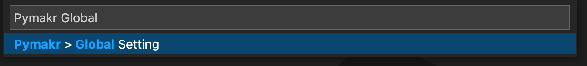
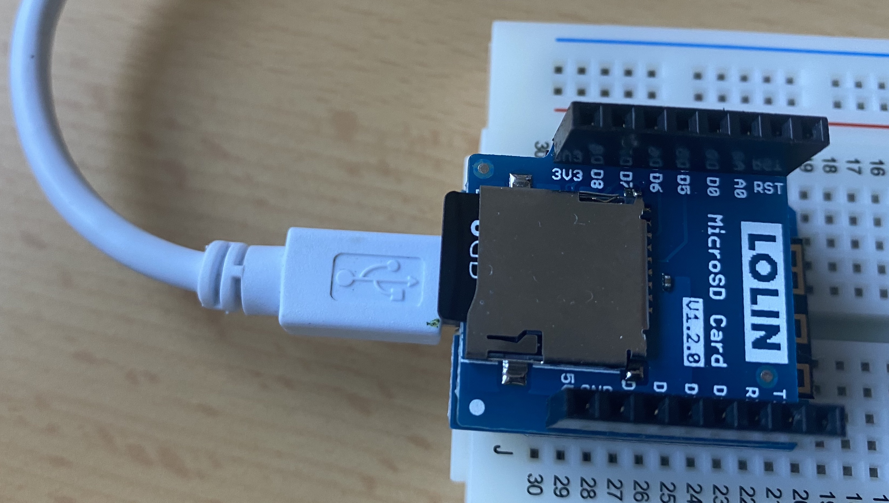

# Developing Software for the ESP8266

There are different microcontrollers used in the Internet of Things (IoT) to build solutions. ESP8266 is one such microcontroller that comes with built in support for WLAN and the Internet Protocol (IP) stack. Different manufacturers package the ESP8266 on boards to make them complete systems, enabling users to provide different IoT solutions. There  are many ways of programming the ESP8266 to perform tasks and one of the most popular ways is using the MicroPython language.

In this HOWTO, we explain developing programs for the ESP8266 using the MicroPython language. We use the **Wemos D1 board** as the base system when explaing the development process. To load programs to the **Wemos D1 board**, it must be connected to a computer over USB. The picture below shows a **Wemos D1 board** placed on a Breadboard connected to a computer ready for loading programs.

<center>
    
</center>

This HOWTO consist of the following sections. Click on the link to go to the relevant section or read from the begining.

1. [Prerquisites](#prerequisites) - Describes what is required to setup a development environment for the ESP8266
2. [Setting Up the Development Environment](#setting-up-the-development-environment) - Details the setting up of the tools required to develop software for the ESP8266
3. [Flashing The Latest Firmware](#flashing-the-latest-firmware) - Describes how to flash the latest firmware on the ESP8266
4. [Developing and Loading a Simple Program](#developing-and-loading-a-simple-program) - Describes a how a simple program is programmed, including structure of the structure expected by the ESP8266 and how the developed program is loded
5. [Program to Read from a Temperature Sensor](#program-to-read-from-a-temperature-sensor) - Describes how a simple program that reads values from a temperature sensor connected to a ESP8266 is written and loaded
6. [Program to Write and Read an SD Card](#program-to-write-and-read-an-sd-card) - Describes how an SD card is used in an ESP8266
7. [Program to Enable a WLAN Access Point](#program-to-enable-a-wlan-access-point) - Describes how a the WLAN access point is brought up in ESP8266
8. [Program to Enable the Web Server](#program-to-enable-the-web-server) - Describes how the web server in the ESP8266 is brought up programatically

9. [Program to Make Files in SD Card Visible on Web Pages](#program-to-make-files-in-sd-card-visible-on-web-pages) - Describes how to program the web pages that can be used to download the contents of the web pages


-----

## Prerequisites

Developing for the ESP8266 require the use of a number of other programs to write code and upload to the ESP8266. They have to be insatalled in your computer. They are as follows.

- Python Development Environment
- Python Package Manager
- Firmware Flashing Tool
- Node.js Development Environment
- Visual Studio Code Editor
- Pymakr Extension

A description of using these programs are given in the next sections.

-----

## Setting Up the Development Environment


#### 1. Python 3

Install Python 3 in your computer. There are many sources for installing Python. Please identify the best way to install Python for the specific operation system in your computer. Check the following link about inatalling Python 3.

  [https://www.python.org/downloads/](https://www.python.org/downloads/)

Some operating systems come pre-installed with Python. Run the following command in your computer to see if Python 3 is installed.

<center>

</center>


#### 2. Python Package Manager

Install the Python package manager `pip` in your computer. Check the following link to install `pip`

[https://packaging.python.org/en/latest/guides/installing-using-pip-and-virtual-environments/](https://packaging.python.org/en/latest/guides/installing-using-pip-and-virtual-environments/)

To check whether `pip` is installed, run the following command.

<center>

</center>


#### 3. Firmware Flashing Tool

Install the firmware flashing tool `esptool` in your computer. Check the following link for installation details.

[https://docs.micropython.org/en/latest/esp8266/tutorial/intro.html](https://docs.micropython.org/en/latest/esp8266/tutorial/intro.html)

Once installed, check if it works as seen below.

<center>

</center>


#### 4. Node.js

Install the Node.js development environment in your computer. Check the following link for installation details.

[https://nodejs.org/en/download/](https://nodejs.org/en/download/)

Once installed, check on the command line if installed.

<center>

</center>


#### 5. Editor

The development and installation of programs is done using the Visual Studio Code editor of Microsoft. Check the following link for installation.

[https://code.visualstudio.com/download](https://code.visualstudio.com/download)

Once installed, check the applications area to see if `Visual Studio Code` is installed.


#### 6. Pymakr Extension

The Pymaker extension in Visual Studio Code enables the uploading of Micropython code to the ESP8266. To install Pymakr, run `Visual Studio Code` and click on the `Extensions` icon on the `Activity Bar` (left of the screen). The picture below shows Pymakr installed.

<center>
    
</center>


#### 7. Connect ESP8266

Connect the ESP8266 board to the computer where your development envoronment (above) was installed. Since most ESP8266 boards use Micro USB ports, they usually usually use Micro USB to USB A cables to connect the board to the computer. The picture below shows a `Wemos` board connected to a computer.

<center>
    
</center>

When connected, the ESP8266 board will bring up a device entry in the computer. In Microsoft Windows, this is a `COM` port such as `COM3` which can be seen on the `Device Manager`. On MacOS or Linux, this will be a `/dev` entry such as `/dev/tty.usbserial-1410`. 


#### 8. Configure Pymakr

Once the Pymakr extension is installed and the ESP8266 board is connected, it's settings of Pymakr have to be adjusted. Sometimesa the port port name is detected automatically due to the default settings in the Pymakr. But, sometimes, the port name must be specified. The steps are as follows.

1. Click on the `All commands` button at the bottom of the Visual Studio Code editor (see picture below).

<center>
    
</center>

2. Type `Pymakr > Global Settings` and select it (see picture below).

<center>
    
</center>

3. Selecting `Global Settings` will open the `pymakr.json` file with all the settings of Pymakr. You are required to set the `address` and `auto_connect` variables to configure the port related information. In the example below, the port is set in a computer running MacOS. Details about the port name is given in [7. Connect ESP8266](#7-connect-esp8266).

```json
{
    ...
    "address": "/dev/tty.usbserial-1410",
    ...
    "auto_connect": false,
    ...
}
```

If the ESP8266 has been idenified by the Pymakr extension, then the following prompt should appear in the `TERMINAL` area of Visual Studio Code.

<center>
    
</center>

The prompt you see is of a Micropython console. Type the following Micropython statement and check the output. The code will be executed in the ESP8266 microcontroller itself.

```Python
print('Hello World!!!')
```


-----

## Flashing The Latest Firmware

Once all the components of the development environment is setup in a computer as listed in [Setting Up the Development Environment](#setting-up-the-development-environment), you can use the `esptool` to flash the Micropython firmware. Listed below is the procedure.


#### 1. Download Micropython Firmware

There are different Micropython firmware versions for different micro-controllers. We use the `Espressif` versions of the firmware as the `Wemos` we use is bsased on ESP8266. Use the link below to find the right firmware.

[https://micropython.org/download/?port=esp8266](https://micropython.org/download/?port=esp8266)

For the `Wemos`, we use one of the firmwares shown in the picture below.

<center>

</center>

The firmware file is a `.bin` file which for example, may look like `esp8266-20210618-v1.16.bin`.


#### 2. Flash Firmware

The firmware is flashed using the downloaded `esptool` (described above). The command to run is als follows.

```
esptool.py --port /dev/tty.usbserial-1410 --baud 1000000 write_flash 
          --flash_size=4MB -fm dio 0 ./esp8266-20210618-v1.16.bin
```

When flashing the built-in blue LED of the ESP8266 board blinks to indicate activity.


-----

## Developing and Loading a Simple Program

The ESP8266 board comes with a built-in LED connected to the 2nd GPIO pin. In this section we write a simple program in Micropython to blink this LED 10 times.

The procedure for writing and loading the code to the ESP8266 is as follows.

#### 1. Create programming environment

Start Visual Studio Code and click on `Open` or `Open Folder` and once the dialog comes up, ceate a folder of with your preferred name. For this example, name it `blink`.

#### 2. File and folder structure

The Micropython firmware expects the following files and structure to be present in the program that is loaded. 

```
+-- boot.py
+-- main.py
+-- lib
    +-- comm.py
```

The `boot.py` is run first when the microcontroller boots and is used to include any one time configurations. The `main.py` is where the program of the user is written. In our simple example (below), we program the blinking of the built-in LED in the `main.py` file. The `lib` folder usually holds any additional Micropython files required in program.

#### 3. Write Program Code

The built-in LED os the ESP8266 board is connected to the GPIO pin number 2. We use the `Pin` class in the `machine` libraray of Micropython to control the built-in LED. The program below loops 10 times, each time lighting or switching off the LED. This makes the LED to appear as blinking. This program is coded in the `main.py` file. We leave the `boot.py` empty and 

```Python
# import required libraries
from machine import Pin
from time import sleep

# get reference to output pin 2
led = Pin(2, Pin.OUT)

# loop for 20 times
for i in range(20):
    # switch LED on/off
    led.value(not led.value())

    # wait for 1 second
    sleep(1)
```

The `led.value(not led.value())` statement switches LED on/off based on the current state - if it is currently on, then it is switched off, vise versa if it is currently off.  The `sleep(1)` requests the program to wait for a second after changing LED state.


#### 4. Code Errors

When writing code, there is always the possibility of making mistakes. Visal Studio Code shows whatever errors it can identify as errors. The picture below shows the program code with 2 errors (red arrows). 

<center>
    
</center>

If the mouse cursor is hovered above the error, Visual Studio Code will provide information about the error. The second error shown is a Micropython syntax error. The right keyword is `range`. In the first error, Visual Studio Code is complaining that the `machine` library is unknown. Visual Studio Code has only information about standard Python and its libraries, but is unaware of libraries of Micropython. Therefore, this error can be safely disregarded.


#### 5. Load program

Once the program is written, press the `Upload` button to load the program to the ESP8266. This action will not only load, but also start running the program. 

<center>
    
</center>


-----

## Program to Read from a Temperature Sensor


-----

## Program to Write and Read an SD Card

The ESP8266 board can be attached a Micro SD card to store aand read files. The picture below shows a Micro SD card sheild mounted on the ESP8266. 

<center>
    
</center>


-----

## Program to Enable a WLAN Access Point


-----

## Program to Enable the Web Server


-----

## Program to Make Files in SD Card Visible on Web Pages


